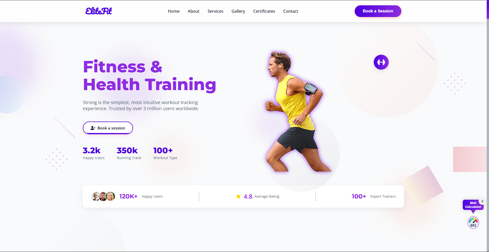
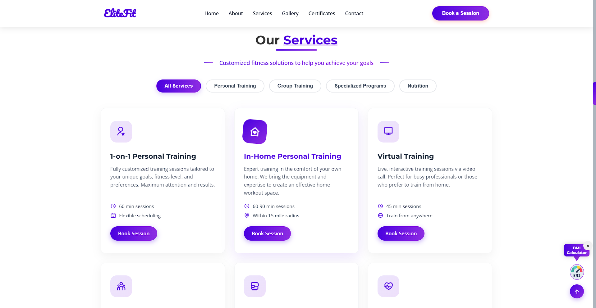
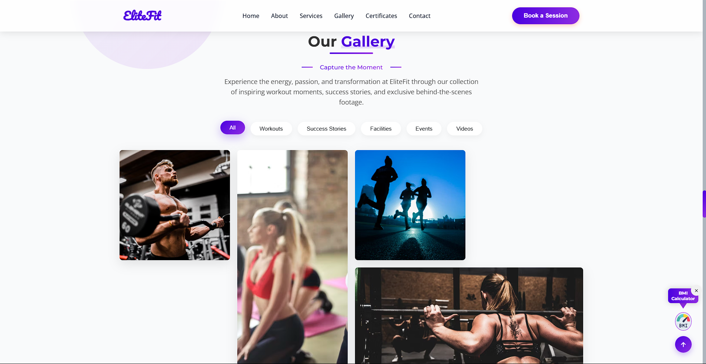

# 🏋️‍♂️ Fitness Website

A modern, responsive **fitness landing page** designed to promote gym or fitness-related services. This website serves as a **frontend-only** static site that highlights key features of a gym such as its programs, benefits, testimonials, and a call-to-action for new customers to join.

🚀 **[Live Website →](https://sunilbaghel002.github.io/Fitness-website/)**

---

## 💡 What This Website Does

The Fitness Website is structured as a one-page layout, ideal for gym owners or fitness centers looking to establish a professional online presence. It:

- Presents a **hero section** to instantly engage visitors.
- Highlights **core fitness programs and services** offered.
- Shares **client testimonials** to build trust.
- Features a **call-to-action** for membership or inquiries.
- Provides a clean, animated, and mobile-friendly browsing experience.

It's perfect as a **landing page** for fitness businesses or as a practice project to learn frontend web development.

---

## 🔍 Features

- ✅ Fully responsive layout across all devices
- ✅ Smooth scroll and animated sections
- ✅ Hero section with call-to-action
- ✅ About & Services sections
- ✅ Fitness programs highlight
- ✅ Testimonials from clients
- ✅ Footer with basic contact info or CTA
- ✅ Easy to customize and extend

---

## 📸 Screenshots


### 🔼 Hero Section


### 💪 Services & Programs


### 📸 Gallery


---

## 🛠️ Technologies Used

- **HTML5**
- **CSS3**
- **JavaScript (vanilla)**

---

## 📂 How to Use

1. Clone the repository:
   ```bash
   git clone https://github.com/SunilBaghel002/Fitness-website.git
